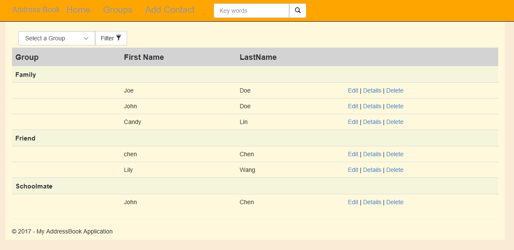
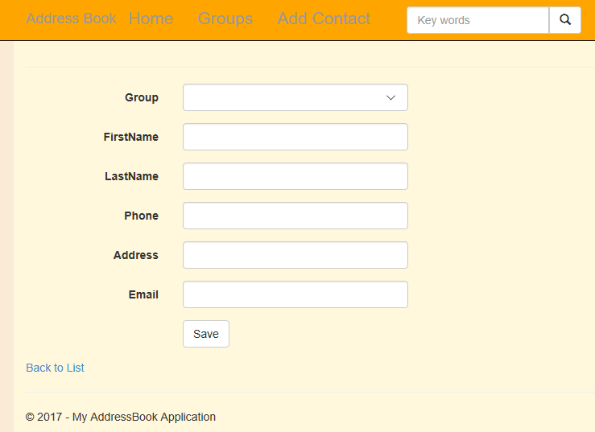
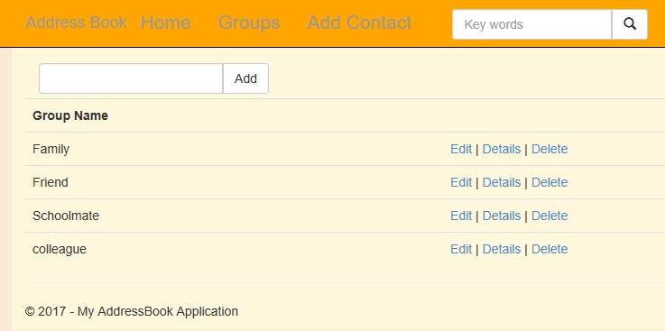
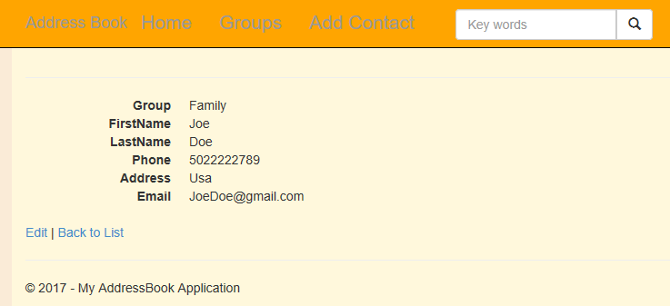
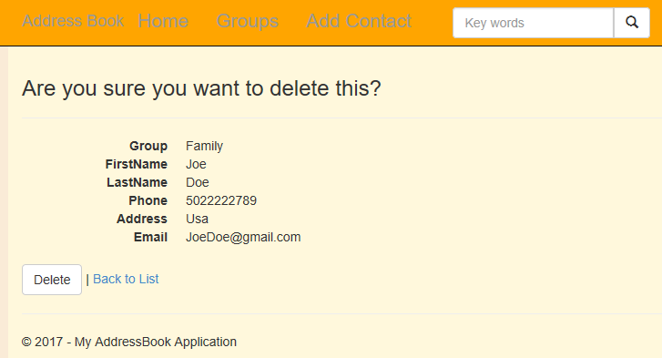

<h1 id="AddressBookApp">AddressBookApp</h1>
<ul>
  <li><a href="#synopsis">Synopsis</a></li>
  <li><a href="#requirements">Requirements</a></li>
  <li><a href="#installation">Installation</a></li>
  <li><a href="#contributing">Contributing</a></li>
</ul>
<h2 id="synopsis">Synopsis</h2>
This is an app that you can save your name, phone number, address, and email address.
It uses C#/.Net language, base on ASP.NET MVC, Entity Framework, SQL database.

This is the home page, it showcases a list of contact information.
You can use the search box to search contacts, and use the Filter box to filter the contacts by group. 

When clicking the "Add Contact", you can add a new contact to the list:

When clicking the "Groups", you can see a list of group information:

When clicking the "edit", you can edit the current contact:

When clicking the "detail", you can check the detail of the current contact:

When clicking the "delete", you can delete the current contact:

<a href="#AddressBookApp">Go back to the top</a>

<h2 id="requirements">Requirements</h2>

AddressBookApp requires the following to run:

<ul>
  <li>Visual Studio</li>
  <li>SQL LocalDB</li>
</ul>

<h2 id="installation">Installation</h2>
<ol>
  <li>Clone or download it</li>
  <li>Build Solution</li>
  <li>Run the project</li>
</ol>

<h2 id="contributing">Contributing</h2>
<ol>
  <li>Fork it</li>
  <li>Create your feature branch</li>
  <li>Commit your changes</li>
  <li>Push to the branch</li>
  <li>Create new Pull Request</li>
</ol>
<a href="#AddressBookApp">Go back to the top</a>
